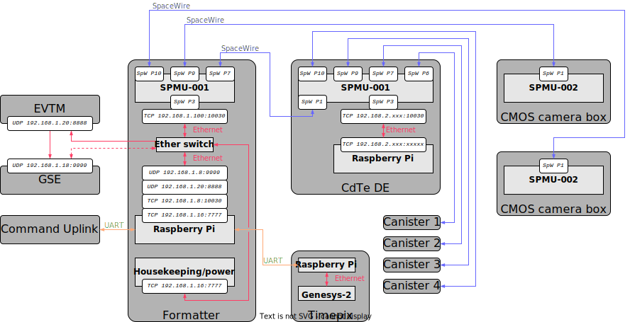

# foxsi-4matter
Code for the FOXSI-4 formatter.

This formatter replaces older FOXSI formatters with a [Raspberry Pi](https://www.raspberrypi.org) processor unit. A peripheral SPMU-001 board (based on the Xilinx Spartan 7) for [SpaceWire](https://www.star-dundee.com/wp-content/star_uploads/general/SpaceWire-Users-Guide.pdf) communication support.

## Setting up
See [PISETUP.md](PISETUP.md) for instructions on booting and configuring the Raspberry Pi.

### Dependencies
- [Boost](https://www.boost.org/)
    - boost::asio
    - boost::bind
- [nlohmann JSON](https://github.com/nlohmann/json)
- [Doxygen](https://doxygen.nl/)
- [googletest](https://github.com/google/googletest)
- [concurrentqueue](https://github.com/cameron314/concurrentqueue) (included)
- [spdlog](https://github.com/gabime/spdlog) (included)

### Examples
You can find a few examples in the [examples folder](examples).

## More detail
The physical system is laid out like this:



## How to build
In the following, "your computer" is a laptop or desktop connected to the Raspberry Pi which actually runs the software.

Decide whether you need to build the software on your local computer in addition to building on the Raspberry Pi. If you make local edits and want to check that everything compiles, or if you want to run certain tests, or if you want to use the `foxsimile` emulator, you should build locally. If all you need to do is forward code to the Raspberry Pi and build it there, skip to [building on the Raspberry Pi to run](#building-on-the-raspberry-pi-to-run).

### Installing dependencies
If this is your first time building on your computer, you may need to install two dependencies. I can only provide instructions for macOS using Homebrew:
```bash
brew install nlohmann-json
brew install boost
brew install doxygen
brew install googletest
```
(if you want to check if they are already installed, you can run `brew info <package name>` to check).

I have used `boost` v1.83.0 and v1.80.0, and `nlohmann-hson` v3.11.3. I expect other 1.8x versions of `boost` and other 3.1x versions of `nlohmann-json` to also work, but have not tested.

### Building on the Raspberry Pi to run
The flight Raspberry Pi already has dependencies installed. If you are setting up a brand new Raspberry Pi, see [PISETUP.md](PISETUP.md). Otherwise, choose instructions for either
1. [setting up from](#set-up-from-a-release) a [tagged release](https://github.com/foxsi/foxsi-4matter/tags), or
2. [setting up from the latest version of the `main` branch available](#set-up-from-latest-main).

#### Set up from a release
Select the release you want to build on the [`foxsi-4matter` tags page](https://github.com/foxsi/foxsi-4matter/tags). On the page for a specific release ([v0.0.8, as an example](https://github.com/foxsi/foxsi-4matter/releases/tag/v0.0.8)) download the .zip or tar.gz archive to your computer. 

Unzip the archive you downloaded, then open a terminal inside that folder (which should be named `foxsi-4matter-x.y.z`, where `x.y.z` is the version number you downloaded). From that terminal, run:
```bash
git clone https://github.com/foxsi/foxsi4-commands.git
```
to add the command repository to your release. If you want to try building software on your computer first, run this sequence of commands inside the folder `foxsi-4matter-x.y.z`:
```bash
mkdir build
cd build
cmake ..
cmake --build .
```
You can omit this local build step if you just want to build on the Raspberry Pi.

#### Set up from latest `main`
Open a terminal in a folder where you want this code, and run
```bash
git clone --recursive https://github.com/foxsi/foxsi-4matter.git
```

If you want to try building on your computer first, run this sequence of commands inside the folder `foxsi-4matter` that was just created:
```bash
mkdir build
cd build
cmake ..
cmake --build .
```

#### Building on Raspberry Pi
Now that you have code stored on your computer, you can push the code base to the Raspberry Pi over an Ethernet connection. First, `ssh` into the Raspberry Pi:
```
ssh foxsi@192.168.1.8
password:...
```
If you have issues `ssh`ing, make sure you can ping the IP `192.168.1.8` and that your local subnetwork includes that address.

Once inside the Pi, create a new folder to hold your build and enter it:
```bash
mkdir your-folder-name
cd your-folder-name
```

From another terminal on your computer, navigate to the downloaded `foxsi-4matter` code, which should be in a folder called either `foxsi-4matter` (for a build from `main`) or `foxsi-4matter-x.y.z` (for a build from a release). Then run this command (it's long) to push the code into `your-folder-name` in the Raspberry Pi:
```bash
rsync -av --exclude=build --exclude=bin --exclude=doc --exclude=log ../foxsi-4matter-x.y.z foxsi@192.168.1.8:/path/to/your-folder-name
```
but replace `-x.y.z` with the version number, or omit it entirely for a build from `main`; and replace `/path/to/your-folder-name` with the real path to the folder you created.

Now, go back to your other terminal that is still `ssh`'d inside the Raspberry Pi, and create a `build` folder inside `your-folder-name/`:
```bash
mkdir build
cd build
cmake ..
cmake --build . -j4
```
The Raspberry Pi build process takes a couple minutes. This will create several binaries in `your-folder-name/bin/` that you can run.   

## How to use

First, command the power board to turn on/off the desired systems. Then start software on detector readout systems.

### Starting remote software
#### CdTe DE
As of Dec 16 2023, the DE software no longer needs to be started manually. You can ignore this section.
```bash
ssh de
```
(on the GSE computer) then navigate to the DE main software:
```bash
cd CdTe_DE/production/run/
```
and run the DE software:
```bash
./main_CdTeDE configuration_spmu001.xml
```

For detail, go to the [DE github repository](https://github.com/foxsi/CdTe_DE).

The DE will store raw data for each connected detector in `~/CdTe_DE/production/run/data/`. Note that the DE timestamp is disconnected from any all clock time.

#### CMOS
The CMOS readout software automatically starts running on boot. When you start this Formatter software it will command any connected CMOS to start collecting and saving data.

### Detector mapping
The DE identifies connected canisters (in the raw data recordings) on the SpaceWire port they are connected to. The power system requires a unique byte to be sent to turn on/off each system. For the flight configuration, this is the DE nomenclature for each detector and power code:

| System (by focal plane position)     | Detector  | DE number | Power board byte   |
|--------------------------------------|-----------|-----------|--------------------|
| Canister 2                           | no2021_06 | `det4`    | `0x06`             |
| Canister 3                           | no2021_07 | `det2`    | `0x05`             |
| Canister 4                           | no2021_05 | `det3`    | `0x04`             |
| Canister 5                           | no2022_01 | `det1`    | `0x03`             |
| DE                                   | ---       | ---       | `0x00`             |
| CMOS 1                               | `0010`    | ---       | `0x08`             |
| CMOS 2                               | `0002`    | ---       | `0x07`             |
| Timepix                              | ---       | ---       | `0x01`             |
| SAAS                                 | ---       | ---       | `0x01`             |

### Starting the Formatter software
As of Nov 208 2023, the Formatter software also needs to be started manually. Do this:
```bash
ssh formatter
```
then navigate to the Formatter software directory:
```bash
cd foxsi-4matter
```
and then run the formatter software:
```bash
./bin/formatter --verbose --config foxsi4-commands/systems.json
```
When the Formatter runs, it will locally record log files (describing Formatter behavior, not saving detector data) to `~/foxsi-4matter/log/`. You can stop the Formatter with ctrl-C.

On startup the Formatter will walk through each system and try to set it up. No bias voltage will be applied to CdTe. If it cannot talk to a specific system, it will ignore it for data readout (this behavior will be different for flight). 

To record the Formatter raw output on the GSE computer, navigate to `~/Documents/FOXSI/foxsi-4matter/` and run the logging application:
```bash
cd ~/Documents/FOXSI/foxsi-4matter/
python3 util/logudpy.py
```

This will save raw data to `~/foxsi-4matter/log/gse/` under a filename describing the source system for the data (for example, `cmos1_ql.log` is the raw quicklook data output of `cmos1`). **Note that these log files are overwritten on each successive run.** After collecting data you want ot save, copy the file out to a different folder. You can stop logging data with ctrl-C. For the CdTe system, the raw data files can be parsed using the GSE parser.