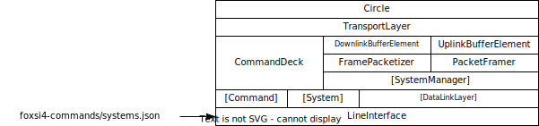

.. foxsi-4matter documentation master file, created by
   sphinx-quickstart on Thu Mar  7 15:13:50 2024.
   You can adapt this file completely to your liking, but it should at least
   contain the root `toctree` directive.

Welcome to the ``foxsi-4matter`` documentation
==============================================

Overview
--------

This is primarily code documentation the `foxsi-4matter` repository, rather than a user guide. I would like to add usage information.

"Quick" start
-------------

If you are setting up this software for the first time on a laptop, refer to `README.md <https://github.com/foxsi/foxsi-4matter/blob/main/README.md>`_ in the main repository.

If you are setting up this software for the first time on a Raspberry Pi, refer to `PISETUP.md <https://github.com/foxsi/foxsi-4matter/blob/main/PISETUP.md>`_ in the main repository.

Dependencies
~~~~~~~~~~~~

* `Boost::asio <https://www.boost.org/doc/libs/1_84_0/doc/html/boost_asio.html>`_
   * This provides non-blocking socket I/O functionality for communication.
* `Boost::program_options <https://www.boost.org/doc/libs/1_84_0/doc/html/program_options.html>`_
   * Used for parsing command line arguments when starting up the software.
* `nlohmann::json <https://github.com/nlohmann/json>`_
   * This is a fun JSON parser. Used here to ingest JSON configuration data from `foxsi4-commands`.
* `cameron314::concurrentqueue <https://github.com/cameron314/concurrentqueue>`_
   * This is a fast, lock-free, thread-safe, multi-producer/multi-consumer queue. I use it just as a multi-producer/single-consumer queue, but it enables simultaneous safe access to the downlink queue from all systems. 
* `gabime::spdlog <https://github.com/gabime/spdlog>`_
   * This is a convenient, fast logging library. 

Configuration
~~~~~~~~~~~~~

A healthy amount of configuration data is used to feed this software information about its physical configuration. This includes parameters on time limits and latencies, expected behavior during erros, network topology and node configuration, communication volumes and rates, etc.

Some default parameters are defined in ``Parameters.h``, and the bulk of configuration information is contained in a separate repository, `foxsi4-commands <https://github.com/foxsi/foxsi4-commands>`_. 

Here is the network configuration:

.. image:: ../../assets/formatter_layout.svg

An overview of the system configuration data can be found here:

.. toctree::
   :maxdepth: 1

   system_config.rst

Mockup testing
~~~~~~~~~~~~~~

This code contains a mocking framework called ``foxsimile`` that can be used to simulate the formatter talking to detector subsystems, without actually running any of the system hardware. This enables testing of software changes on a laptop. Overview of the ``foxsimile`` framework can be found here: 

.. toctree::
   :maxdepth: 1 

   foxsimile.rst

Class reference
---------------

The software is abstracted like this, with lower layers constraining and configuring the behavior of higher layers:

.. toctree::
   :maxdepth: 2

   class_reference/circle
   class_reference/layers
   class_reference/buffers
   class_reference/commanding
   class_reference/systems
   class_reference/timing
   class_reference/line_interface

Namespace reference
-------------------
.. toctree::
   :maxdepth: 2
   
   namespace_reference/namespaces

Indices and tables
==================

* :ref:`genindex`
* :ref:`search`
